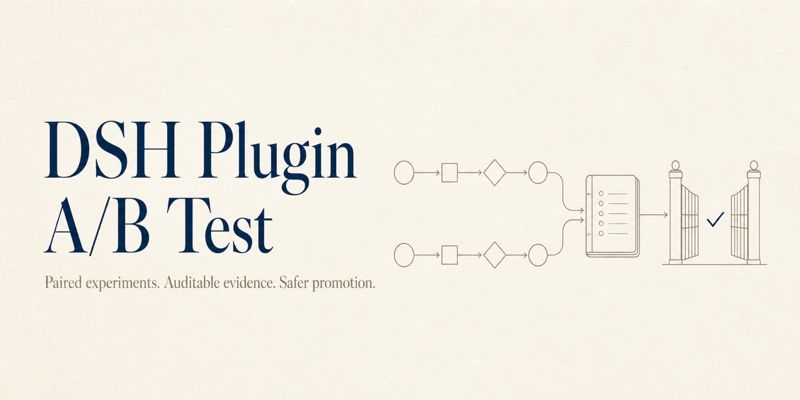

<p align="center">
  
</p>

<p align="center">
  <strong>English</strong> · <a href="./README.zh-CN.md">简体中文</a>
</p>

# DSH Plugin A/B Test

> Test a DSH plugin change on the same tasks before you ship it.

DSH Plugin A/B Test runs your current plugin (Control) and proposed change (Candidate) in isolated DSH environments, pairs their results case by case, and produces evidence you can review before release.

It helps answer three practical questions:

- Did the Candidate improve task success?
- Did that improvement come with a meaningful regression in tokens, latency, or tool errors?
- Can someone else reproduce the result from the same inputs?

Every experiment ends with one of four deterministic outcomes: `PROMOTE`, `REVIEW`, `REJECT`, or `INCONCLUSIVE`. Even `PROMOTE` is an offline recommendation only—this project never changes your real DSH profile or publishes a plugin for you.

## See the decision first

This is a real result from the repository's offline example, with unrelated fields omitted:

```json
{
  "outcome": "PROMOTE",
  "validPairCount": 2,
  "invalidPairCount": 0,
  "triggeredRules": ["primary.superiority"]
}
```

Alongside the decision, you get raw session evidence, assertion results, pair-level deltas, and reports in JSON, Markdown, and HTML. The model does not choose the outcome; deterministic rules from the experiment manifest do.

## Install into DSH

DSH manages plugins per profile. The package targets the pinned `@deepseek-ai/dsh@0.1.0-rc.7` contract, and the profile name is required by that CLI:

```bash
dsh plugin --profile web add 'github:Morriaty-The-Murderer/dsh-plugin-abtest#<full-commit-sha>'
dsh --profile web --dump-default-config
```

Use a reviewed full commit SHA rather than a mutable branch. A Git install builds the package during installation; the first public npm release will provide a prebuilt tarball and the shorter stable command below:

```bash
dsh plugin --profile web add dsh-plugin-abtest@0.1.0
```

The npm command is intentionally documented ahead of release but does not work until version `0.1.0` is published and verified in the registry. Restart a running profile after adding, removing, or updating the bundle.

## Run from source

The current MVP runs from source and requires Node.js `^22.19.0 || >=24.0.0` and pnpm `11.19.0`. The starter experiment uses an offline scripted provider, so no model API key is required.

```bash
pnpm install --frozen-lockfile

node --import tsx src/cli/bin.ts init --output ./my-experiment --json
node --import tsx src/cli/bin.ts freeze --manifest ./my-experiment/experiment.yml --output ./evidence --json
node --import tsx src/cli/bin.ts run --manifest ./my-experiment/experiment.yml --output ./evidence --json
node --import tsx src/cli/bin.ts decision --manifest ./my-experiment/experiment.yml --output ./evidence --json
node --import tsx src/cli/bin.ts report --manifest ./my-experiment/experiment.yml --output ./evidence --json
```

Open `./evidence/<experiment-id>/report.html` to view the static report. To test your own plugin, edit `experiment.yml`, `evals/cases.yml`, and the two variant configurations created by `init`.

## Reproducible real case

The [Toolshrink context-budget case](case-studies/toolshrink-context-budget/README.md) pins DSH, model parameters, one community-plugin commit, deterministic fixtures, and a peak-rate pricing snapshot. Its publishable summary excludes raw sessions, tool output, spill contents, absolute paths, and credentials.

## Understand the outcome

| Outcome | What it means | Typical next step |
| --- | --- | --- |
| `PROMOTE` | Evidence is sufficient, quality meets the target, and guardrails pass | Continue through your human release process |
| `REVIEW` | Results improved, but cost, latency, error rate, or variance needs judgment | Review the pair-level evidence |
| `REJECT` | A hard gate failed, a critical case regressed, or the gain was too small | Fix the Candidate and rerun |
| `INCONCLUSIVE` | There were too few valid pairs, exposure was not proven, or environments were not comparable | Complete the evidence instead of treating it as a failure |

Task success is the default primary metric. You can also guard token usage, P95 latency, and tool error rate. Thresholds, minimum valid pairs, repetitions, and concurrency all live in the manifest. See the [manifest reference](docs/manifest.md) and [decision rules](docs/decisions.md) for details.

## Why the evidence is trustworthy

- **Paired tasks:** Control and Candidate receive the same case, workspace fixture, and model parameters.
- **Balanced order:** Pair order alternates to reduce fixed first-run bias.
- **Isolated environments:** Each arm gets its own `DSH_HOME`, profile, workspace, session root, and frozen plugin artifact.
- **Traceable artifacts:** Sources may be a local directory, tarball, exact npm version, or pinned GitHub commit; hashes are checked again before execution.
- **Proven exposure:** Session events, tool calls, plugin receipts, or workspace changes show whether the target plugin actually participated.
- **Blind comparison:** An optional comparator sees anonymous A/B outputs; identity is revealed only after comparison.
- **Honest infrastructure failures:** Provider outages, corrupted sessions, and environment mismatches become invalid evidence or `INCONCLUSIVE`, not fake Candidate regressions.

Evidence is stored under one experiment directory:

```text
<output>/<experiment-id>/
├── manifest.lock.json
├── control-artifact.json
├── candidate-artifact.json
├── pairs/<case-id>-<repetition>/
│   ├── pair.json
│   ├── measurement.json
│   ├── control/
│   └── candidate/
├── comparison.json
├── decision.json
├── report.md
└── report.html
```

Completed pairs are reused by later `run` commands, and partial state is never silently overwritten. If inputs change or evidence is damaged, use a new output root.

## Connect to real DSH

Non-`mock` providers invoke the exact pinned version `@deepseek-ai/dsh@0.1.0-rc.7`. Add model credentials and other environment variables by name to `extensions.environment_allowlist`. Fingerprints and artifact metadata store only the allowlist hash, never the original values.

OpenAI-compatible Chat Completions endpoints can use `provider: openai-compatible` with an explicit `parameters.host`, `parameters.apiKeyEnv`, and model `name`. The API key value remains in the referenced environment variable; literal keys in a manifest are rejected. See the [manifest contract](docs/manifest.md#runtime) for the exact shape and protocol boundary.

Plugin and test-command stdout, stderr, and session logs are retained as raw evidence, so integrations must still avoid printing secrets.

The CLI is a trusted local automation boundary and may run commands explicitly declared in the manifest. Optional DSH/Cordis tool entry points are model-facing, so they reject experiments containing `command_test` rather than becoming arbitrary command-execution tools.

The complete CLI includes `init`, `validate`, `freeze`, `run`, `status`, `compare`, `decision`, and `report`. Stable exit codes and the live-model smoke procedure are documented in the [verification record](docs/verification.md).

Paid live-model CI is intentionally manual and isolated from pull-request CI. Before enabling it, configure the `live-model` GitHub Environment, reviewer/branch rules, Environment Secret, and guard variable described in the [protected live-model CI guide](docs/live-model-ci.md). Committing the workflow file alone does not create a protected setup.

## Development

```bash
pnpm identity:check
pnpm lint
pnpm typecheck
pnpm test
pnpm test:integration
pnpm test:rename
pnpm test:distribution
pnpm build
pnpm pack --pack-destination <temporary-directory>
```

The package is being prepared for its first public release but is not yet published to npm. See the [architecture](docs/architecture.md) and [upstream audit](docs/upstream.md) for implementation and security boundaries.

Public names, the npm package name, and the CLI name are managed from `project.identity.json`. A real rename test prevents stale public identity from surviving a rename; see the [identity guide](docs/identity.md). Stable protocol identifiers do not change with the project brand.
